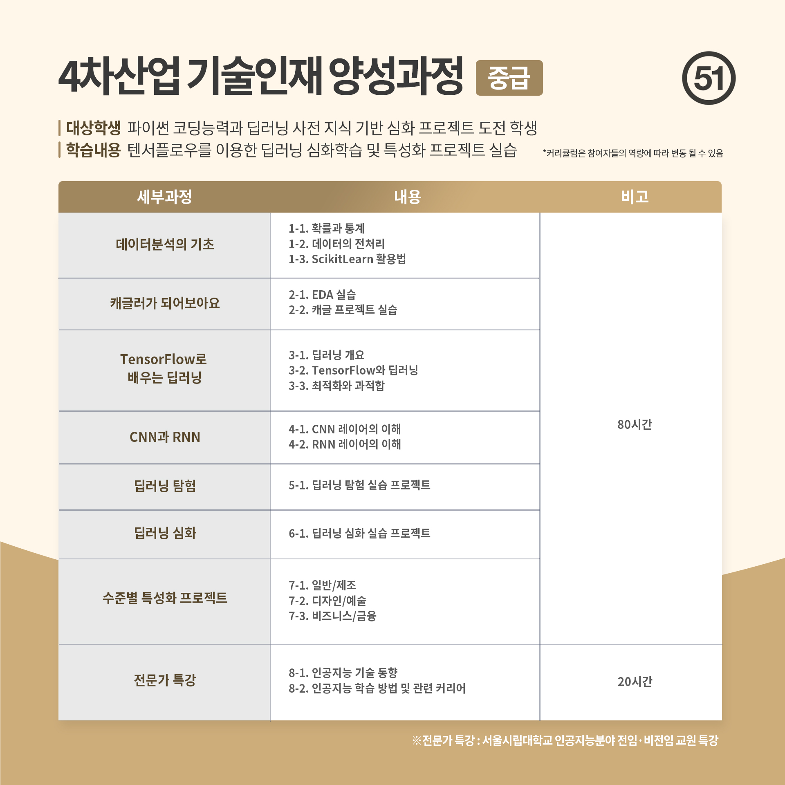

  
<h1 align="center">
  
AIFFEL 클래스 역량 교육

  
</h1>
  
  
<b>교육 분야: 인공지능(AI)</b> 
교육 기간 : 2022년 8월 8일 ~ 8월 26일</b> 

## :bulb: 목표

- **토이 데이터셋을 이용한 데이터 분석**

  > 토이 데이터셋을 이용해 데이터 전처리를 진행한다. 또한 데이터를 관리하기 위해 사용하는 라이브러리(Numpy, DataFrame 등)을 익힌다.

- **머신러닝 개념 공부**

  > 분류/회귀가 무엇인지 파악하고, 예제를 바탕으로 실제로 적용해 본다.

- **딥러닝 개념 공부**

  > CNN, RNN과 같은 신경망에 대해 공부하고, 이미지나 자연어 처리 등으로 실제로 적용해 본다.

 

## :mag: 커리큘럼

 